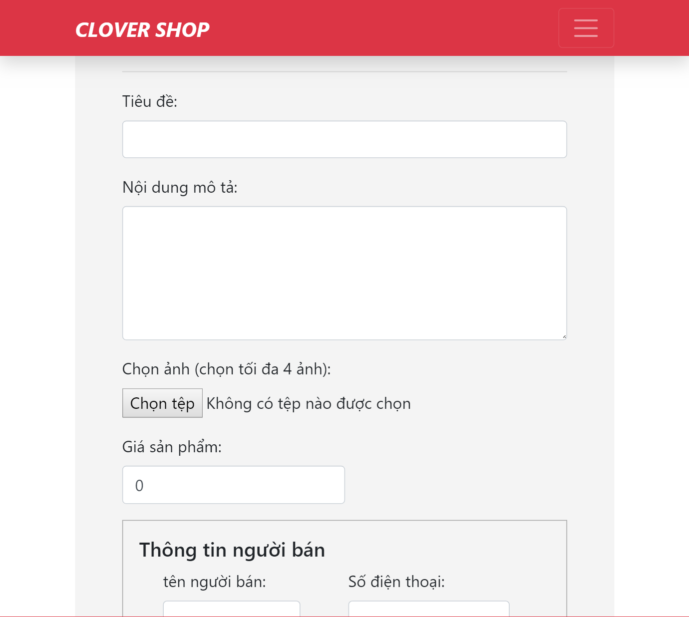

## Sinh viên: Hoàng Vũ Hường
## Mã sinh viên: 17020823
### Nhóm dự án: Nhóm 88
### Vai trò: Tester, Developer

# Báo cáo cá nhân môn học Công nghệ phần mềm
====
* Hoàn thành khóa học trên edx ([Chi tiết](https://github.com/17020932/INT2208-8-2019/blob/master/HoangVuHuong/SoftEng1x.jpg))
* Bài tập nhóm: **Dự án web bán hàng online** [Website](https://clover-shop.herokuapp.com/), [Github](https://github.com/17020932/INT2208-8-2019/tree/master/nhom-88)
* User story: Là một người yêu mua sắm tôi muốn bán những sản phẩm cũ của mình để có thể mua được nhiều đồ mới hơn.
	[Chi tiết](https://github.com/truonganhhoang/INT2208-8-2019/issues/190):
	1) Xác định yêu cầu, mong muốn: 
		- Đăng bán sản phẩm ngay trên trang web (yêu cầu chức năng - specifications)
	Yêu cầu này đã đảm bảo nguyên tắc INVEST guideline.
	2) Quy trình phát triển Scrum (process)
	3) Thiết kế cấu trúc cơ sở dữ liệu và sơ đồ lớp (high level design)
	4) Sử dụng mô hình MVC của framework Laravel (low level design)
	5) Viết mã([Chi tiết](https://github.com/hoangvuhuong/17020823/tree/master/2hand-market/2hand-market/views/page/post-news/index.ejs))
	6) Kiểm thử:
		- [x] Kiểm thử hộp đen để kiểm thử giao diện ( 1 tiếng )
  Link tài liệu: [Kiểm thử hộp đen](https://docs.google.com/document/d/1a4i_31R8WBUAnF91syr1FwBpKoAiTY6rEJt1xWjb74M/edit#heading=h.zhrswbsdiifd)
		- [x]  Dựa vào kiểm thử hộp trắng ( 1 tiếng )
  Link tài liệu: [Kiểm thử hộp trắng](https://docs.google.com/document/d/1a4i_31R8WBUAnF91syr1FwBpKoAiTY6rEJt1xWjb74M/edit#heading=h.ryzy80x4sqk1)
		
	7) Tái cấu trúc: Rà soát mã nguồn để đảm bảo rõ ràng, đơn giản, sạch sẽ và không có mã xấu.(construction)
* Hướng dẫn sử dụng:
1. Mở trình duyệt của bạn lên. Google chrome hoặc FireFox,... tùy trình duyệt bạn cài đặt.

2. Gõ vào ô tìm kiếm địa chỉ sau: https://clover-shop.herokuapp.com/

3. Sau khi trang web hiện ra bạn sẽ nhìn thấy ngay phần **Đăng tin miễn phí** trên phần menu của website. Hãy click vào đó và bắt đầu đăng tin.

4. Bạn điền thông tin sản phẩm gồm tiêu đề, nội dung mô tả, chọn ảnh sản phẩm , đăng giá sản phẩm và điền thông tin người bán.

5. Sau khi điền đầy đủ thông tin sản phẩm, bạn click chuột vào nút **Đăng tin**

6. Khi bạn click đăng tin sẽ hiện ra cửa sổ hỏi xác nhận đăng tin. Click xác nhận để đăng tin.

7. Video demo [video](https://www.youtube.com/watch?v=3jBU_tT_kc0)