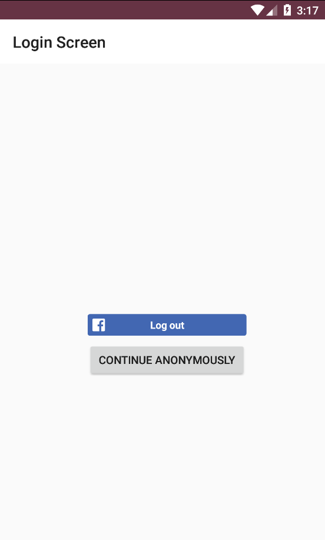
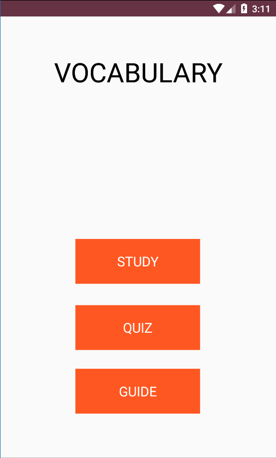
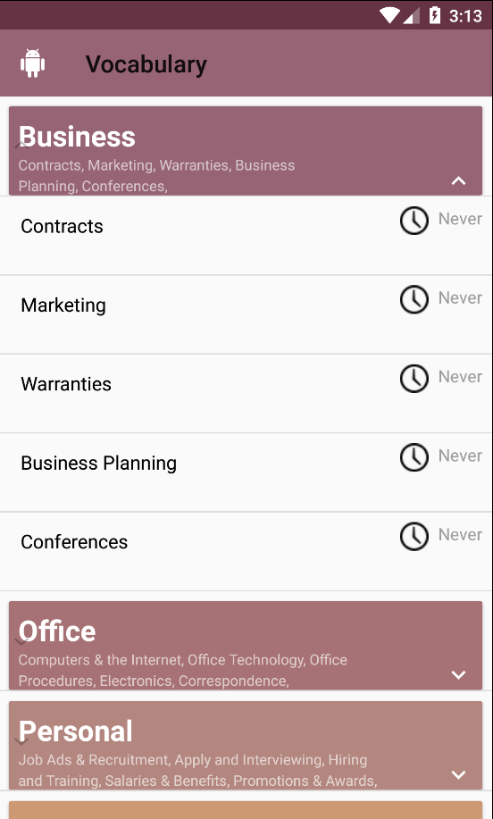
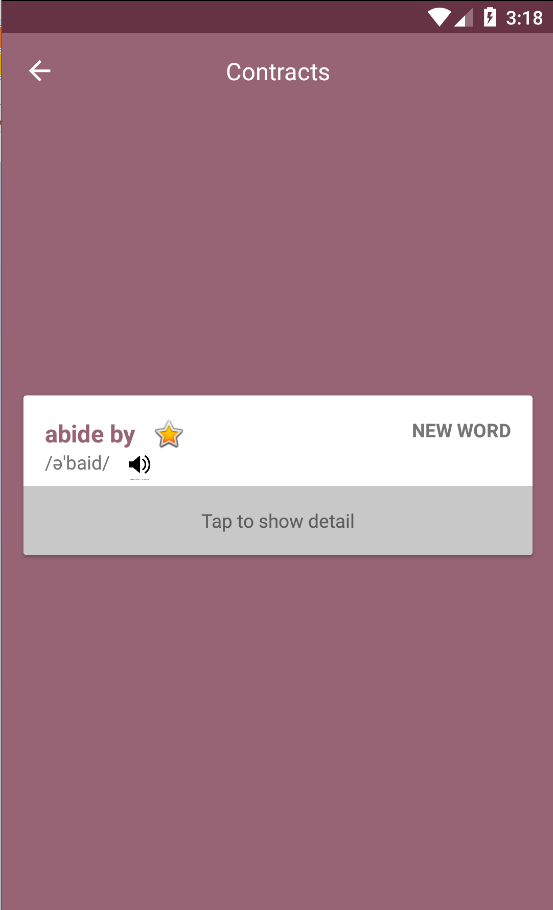
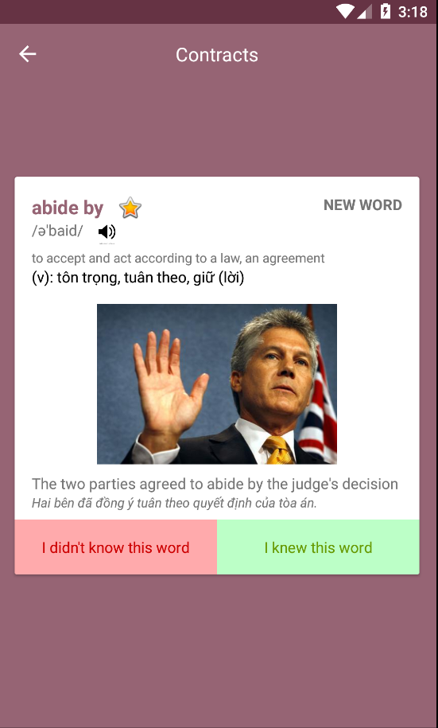
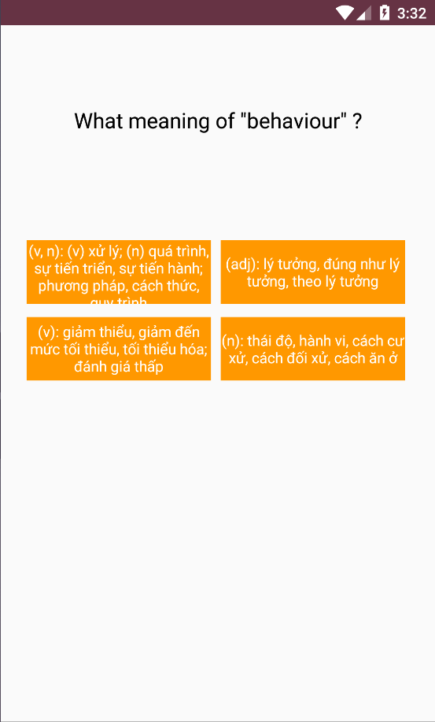
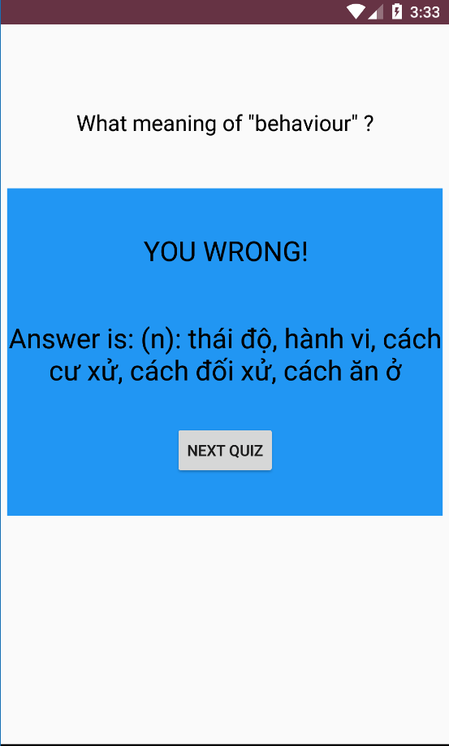
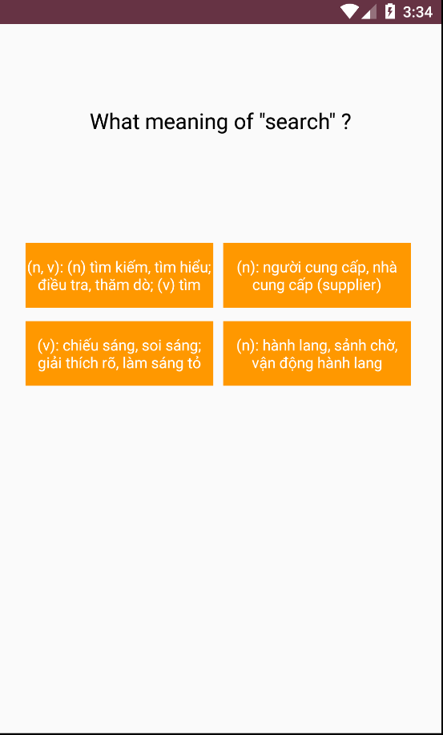
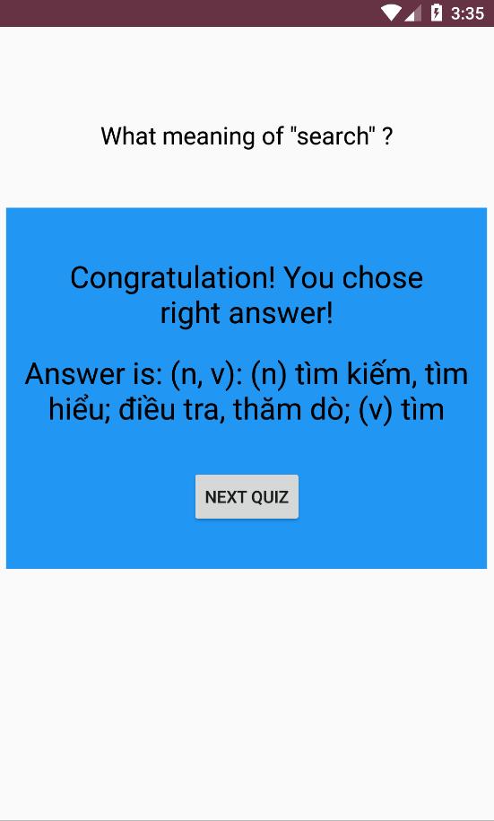

# User story: Là người học, tôi muốn app có hệ thống kiểm tra từ vựng, vì vậy tôi có thể dễ dàng ghi nhớ từ mới hơn

## Quy tắc INVEST:
- Independent: Nó độc lập với các User Story khác, có thể thực hiện riêng
- Negotiable: Có thể chỉnh sửa dễ dàng bằng cách thay đổi dữ liệu
- Valuable: Giúp người học có thể luyện tập từ đó ghi nhớ từ lâu hơn
- Estimable: Có thể ước lượng được thời gian hoàn thành
- Small: Đủ nhỏ để xây dựng trong thời gian ngắn
- Testable: Có thể dễ dàng kiểm thử

## Task lists:
- [x] Phân tích yêu cầu user story, lên ý tưởng
[Specifications](https://docs.google.com/document/d/1a4i_31R8WBUAnF91syr1FwBpKoAiTY6rEJt1xWjb74M/edit#heading=h.fvjpas4blmex)

- [x] Thiết kế database lưu các câu hỏi (Low level design)
[link commit](https://github.com/lightkuriboh/INT2208-8-2019/commit/fd87ed83836d4f793527d86daca9a076a02a7a2c)
- [x] Tạo cơ sở dữ liệu và kết nối chương trình với cơ sở dữ liệu đó
- [x] Thiết kế giao diện cho phần kiểm tra từ
[https://github.com/lightkuriboh/INT2208-8-2019/commit/6c39b804e0523a5fd76d9ab095a87ff2357e1816](url)
- [x] Code logic cho phần kiểm tra từ
[https://github.com/lightkuriboh/INT2208-8-2019/commit/553cf9c140801bb77effff771e5f237cd2d83810](url)

- [x] Làm chức năng thêm từ vào danh sách câu hỏi để kiểm tra

- [ ] Tạo các kiểm thử đơn vị để kiểm thử hộp trắng (unit test)

- [x] Kiểm thử giao diện và độ chính xác của database bằng trải nghiệm thực tế

- [ ] refactor lại code, thêm comment (Construction)

## Demo
### Login

### menu

### Study

### Quiz

